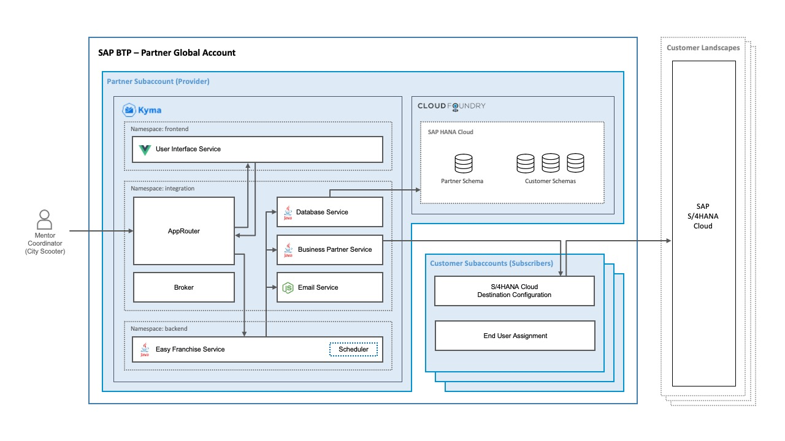

# Develop a Multitenant Extension Application in SAP BTP, Kyma Runtime

## Description
The business scenario of this tutorial has been created with the partner as focus persona. The purpose of this project is to help SAP partners to get a quick start on developing multitenant applications and provide best practices. This is, of course, not exclusively for SAP partners and can be very useful for every person looking for details on how to build a multitenant extension application running on Kyma. It is suitable for new or experienced developers on SAP Business Technology Platform.
[Read More..](https://github.com/dpk-bhat/test-repo/edit/main/README.md)

### Additional Context
Part of the SAP partners ecosystem is built on multitenant applications based on SAP BTP, Kyma runtime. The goal of these applications is to extend the functionality of the SAP solutions, such as SAP S/4HANA Cloud, and to solve customers&#8217; specific business requirements.

### Challenges and Business Drivers
Part of the SAP partners ecosystem is built on multitenant applications based on SAP BTP, Kyma runtime. The goal of these applications is to extend the functionality of the SAP solutions, such as SAP S/4HANA Cloud, and to solve customers&#8217; specific business requirements.

### Solutions
The current mission offers not only expert coaching and technical support, but also trying out a free project, showing best practices that you can use later on to accelerate your outcome.

### Benefits
To understand the multitenancy concept better, you can try out a specific multitenant sample application that extends SAP S/4HANA functionality. You can also learn the different steps to onboard new customers.
Adding other benefits here.

## General Information
|Fields|Values|
|---|---|
|Source|Customer Engagement Executives, Customer Innovation and Maintenance|
|SAP Process|Design to Operate > Acquire to Decommission|
|Product Category|Accounting and Financial Close, Business Technology Platform, CRM and Customer Experience|
|Industries|Consumer Industries, Defense and Security, Life Sciences|
|Lines of Business|(Industry specific LoB), Human Resources|
|Focus Topics|Artificial Intelligence, Featured|
|Tags|uc-tag, focusTopic|

## Internal Information
### Business Questions
Business Questions

### Technical Questions
Technical Questions

### Additional Comments
Additional Comments

### Maturity Level
Use Case based on a Dedicated PoC

### Deployment Effort
30-80 days

### Competitive Differentiation
Low

### Buyer Persona
Chief Customer Officer, Maintenance Director

### Customer Type
Active

### Customer Segment
Key Accounts

## Services

| Service       | Optional      |
| ------------- |:-------------:|
| SAP S/4HANA Cloud for customer order foundation| optional  |
| SAP BTP, Kyma Runtime|  |
| SAP HANA Cloud| optional |
| Some Service | |

## External Information

### Mission Effort
2-4 days

### Mission Prerequisites
Mission Prerequisites

## Guided Answers
- [How to get it done?](https://xs02a6fd67e86.hana.ondemand.com/JobPts/Mobile/DareMat.html#home_screen)
- [Proton Mail](https://account.protonmail.com/authorize?app=proton-mail&state=ECA6uo6o7PjvYmg9i_In5QhPAsF1zv0gbD9UFnBfm7c)
- [How to clear an interview?](https://www.geeksforgeeks.org/top-10-algorithms-in-interview-questions/)

## FAQs
1.   - Question1
     - Answer1
2.   - Question2
     - Answer2

## Solution Diagram

[comment]: <> (This is a comment, it will not be included.)
[//]: <> (This is also a comment.)
[//]: # (This may be the most platform independent comment)
<!-- useCaseMetadata 
{
  Mission Type: "Enterprise Support"
  Sub-category: "SAP S/4HANA Transformation"
}
-->
